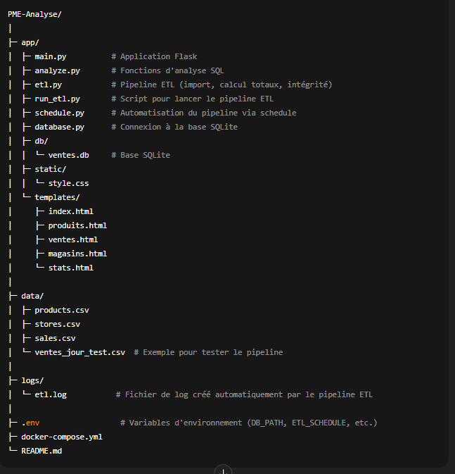
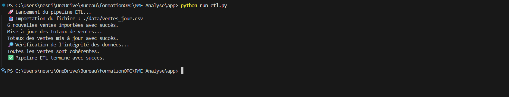
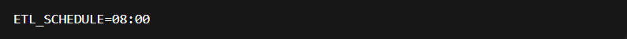

🛍️ Analyse des ventes d’une PME — Projet Data Engineer
🎯 Objectif

Ce projet a pour but de mettre en place une architecture conteneurisée (via Docker) pour :

Importer et structurer des données issues de fichiers CSV (produits, ventes, magasins).

Construire une base SQLite adaptée à l’analyse des ventes.

Offrir une interface web Flask avec affichage des données et graphiques HTML.

Réaliser des premières analyses exploratoires en SQL et Python.

Mettre en place un pipeline ETL automatisé avec logs pour suivre l’intégrité et les totaux des ventes.

<H2>🗂️ Structure du projet</H2>

<H2>📊 Données utilisées </h2> 
<ul>
<li>products.csv → informations sur les produits (ID, nom, prix, stock)</li>
<li>stores.csv → informations sur les magasins (ID, ville, nombre de salariés)</li>
<li>sales.csv → Toutes les ventes (ID produit, quantité, magasin, date)</li>
<li>ventes_jours.csv →affiche  ventes journalières par jours (ID produit, quantité, magasin, date)</li>
</ul>

<H2>Base de données </h2> 
<ul>
<li>produits (ID_produit, nom, prix, stock)</li>
<li>magasins (ID_magasin, ville, nombre_salaries)</li>
<li>ventes (ID_vente, ID_produit, ID_magasin, date, quantite, total_price)</li>
<li>Mise à jours ventes de chaque jour</li>
</ul>

La base SQLite est créée automatiquement via init_db.py et importée depuis les fichiers CSV. 

<H2> ⚙️ Pipeline ETL </h2> 
<ul>
<li>1.Lecture du fichier CSV (ventes_jour.csv ou fichier test).</li>
<li>2.Insertion des ventes dans la table ventes.</li>
<li>3.Calcul du total des ventes par produit (quantite * prix).</li>
<li>3.Mise à jour de la colonne total_price dans la base.</li>
<li>4.Vérification de l’intégrité des données (pas de produits inexistants).</li>
<li>5.Vérification de l’intégrité des données (pas de produits inexistants).</li>
<li>5.Écriture des logs dans logs/etl.log avec horodatage et succès/erreur.</li>
</ul>

<H2>Lancer manuellement le pipeline </H2>
<strong> python run_etl.py </strong>
<ul>
<li>Le fichier etl.log sera créé automatiquement si le dossier logs/ existe.</li>
<li> Les messages typiques dans le log :</li>
</ul> 

<H2>Automatisation quotidienne (optionnelle) </H2>
Via schedule.py et la variable .env :

 />

<H2>Automatisation quotidienne (optionnelle) </H2>
<H3> Construire et lancer avec Docker : </H3>

<H3> Lancer l'application Flask  : </H3>

<H2>Accéder à l’interface web :</H2> 
<ul> 
<li> Page d’accueil : http://localhost:5000</li>
<li> Liste des produits : http://localhost:5000/produits <li>
<li>Liste des ventes : http://localhost:5000/ventes </li>
<li>Liste des magasins : http://localhost:5000/magasins </li>
<li>Statistiques et graphique : http://localhost:5000/stats</li>
</ul> 

<H2>📈 Analyse et statistiques:</H2> 

<ul> 
<li>Total des ventes par produit </li>
<li>Chiffre d’affaires global</li>
<li>Produit le plus vendu </li>
<li>Produit le plus vendu </li>
<li> Période (mois) la plus active</li>
<li>Graphique des ventes par produit (Chart.js intégré dans stats.html)</li>
</ul> 

<H2>📈 🧰 Technologies utilisées</H2> 

<ul> 
<li>Python (pandas, sqlite3, Flask) </li>
<li>Docker / Docker Compose</li>
<li>Chart.js pour visualisation des ventes </li>
<li>Produit le plus vendu </li>
<li> schedule pour automatisation du pipeline</li>
<li>logging pour suivi ETL</li>
</ul> 

