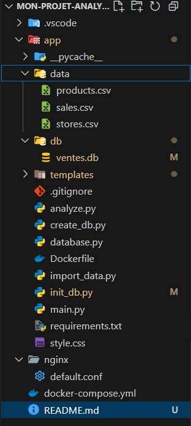

# 🛍️ Analyse des ventes d’une PME — Projet Data Engineer

## 🎯 Objectif

Ce projet a pour but de mettre en place une architecture conteneurisée (via Docker) pour :
- Importer et structurer des données issues de fichiers CSV (produits, ventes, magasins),
- Construire une base SQLite adaptée à l’analyse des ventes,
- Offrir une interface web (Flask) avec affichage des données (HTML),
- Réaliser des premières analyses exploratoires en SQL.

---

## 🗂️ Structure du projet

<h2>📊 Données utilisées  </h2>

- products.csv → informations sur les produits
- stores.csv → informations sur les magasins
- sales.csv → ventes journalières

<h2>🧱 Base de données </h2>

- produits(id, nom, prix, stock)
- magasins(id, ville, nombre_salaries)
- ventes(id, id_produit, id_magasin, date, quantite)

 Création automatique via init_db.py

<h2>Lancement du projet </h2>

1. Construire et lancer avec Docker : docker-compose up --build
2. Initialiser la base de données SQLite et importe les données CSV : python init_db.py
3. Accès au http://localhost:5000 :    python main.py
4. Vérifie le contenu actuel de la base ventes.db

<h2>Interface utilisateur </h2>
Accès à l’interface via :
-  http://localhost:5000 → Page d’accueil
-  http://localhost:5000/produits → Liste des produits
-  http://localhost:5000/ventes → Liste des ventes
-  http://localhost:5000/magasins → Liste des magasins 

